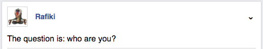
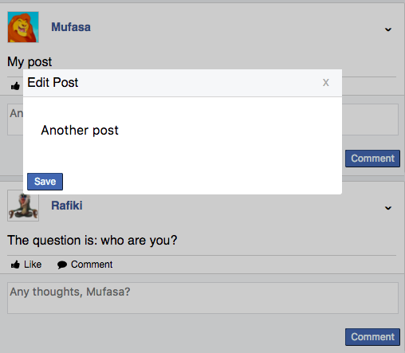
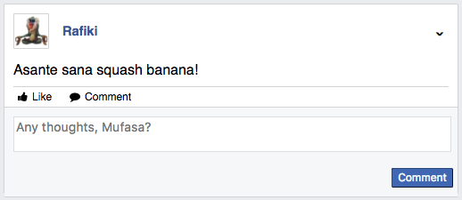
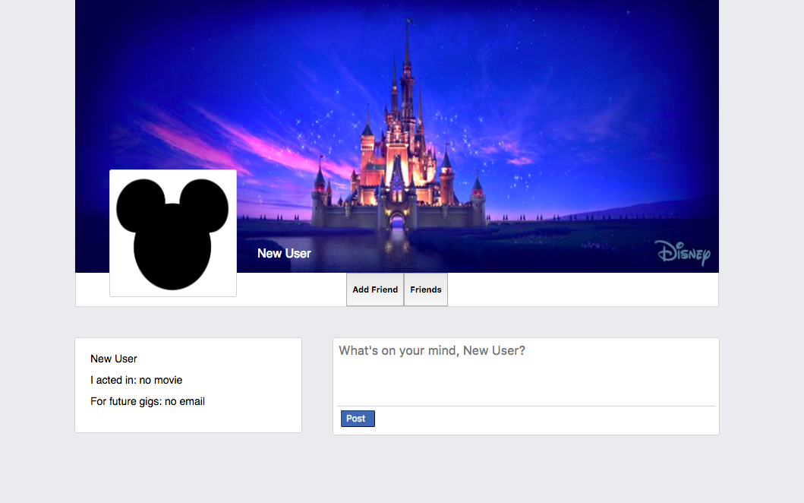
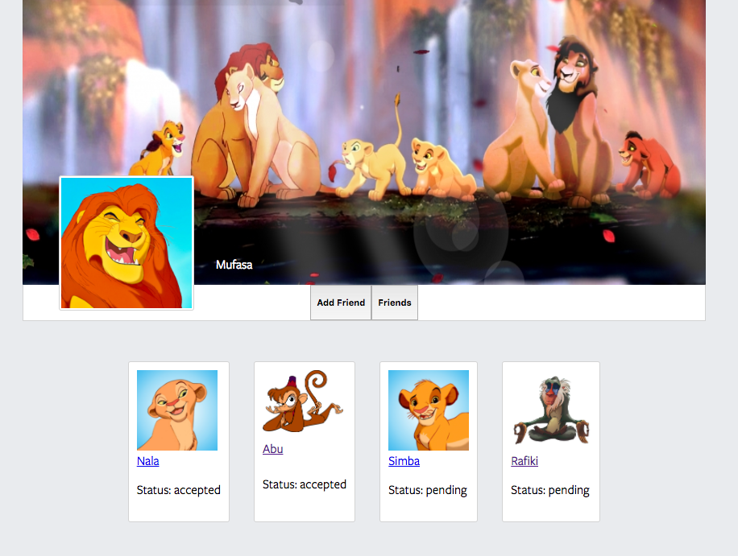

# disneyBook

[Live](https://disneybook.herokuapp.com/#/)

disneyBook is a social media network website, solemnly for Disney characters.
The backend was constructed using Ruby on Rails, and the front with React Redux
and PostgreSQL.

### Features

##### Posts

The sites initial feature allows for users to post on the feed page and
on each others walls; this is the heart of the app. The database maintains
record of all the posts, and their posters (users). For eventual implementation
of "created at", the database keeps record of the time and date the post was
created.




The beneath code shows the post detail component, in which the link to the post author is rendered, as well as the content of the post. The post action container referenced in the code pertains to the button on the right hand side. In the post image above, it is hidden, however on click of the arrow the action component opens up for the user to be able to see the possible actions one could take with the post.


```javascript
<li key={this.props.post.id}>
  <div className="post-author-info">
    <div id="author-pic-and-name">
      
      </img>
      <Link to={`/users/${authorObj.id}`}>{authorObj.name}</Link>
    </div>
    <button onClick={this.handleDropdowns}>ˇ</button>
    {
      this.props.dropdownVisible ?
        <PostActionContainer
          post={this.props.post}
          updatePost={this.props.updatePost.bind(this)}
        /> :
        null
    }
  </div>
  <br />
  <div id="post-body">
    {this.props.post.body}
  </div>
  ```

  If the current user is the author of such post, clocking the arrow and opening the dropdown component would display the options of editing or deleting the post. The editing post component is displayed as a modal. This modal was created without the use of the React Modal library, makes for easier debugging when the bug lies within the modal.

  

  ##### Comments

  Every post has a comments section which allows the current user to comment on other authors posts. The beneath picture portrays the comment input for a post made by Rafiki.

  

  ##### Profiles

  Upon creation, each user is given a profile with a default cover image as well as profile picture.

  

  ```javascript
  constructor(props) {
    super(props);
    this.state = { email: '', password: '', name: '', movie: '' };

    this.handleSubmit = this.handleSubmit.bind(this);
    this.handlePassword = this.handlePassword.bind(this);
    this.handleEmail = this.handleEmail.bind(this);
    this.handleName = this.handleName.bind(this);
    this.handleMovie = this.handleMovie.bind(this);
  }
  ```

  ##### Friending

  A user has friends and can add friends. They can see who their friends are and other users friends through the profile page. They can also see the status of that friendship, whether its pending or accepted.

  
